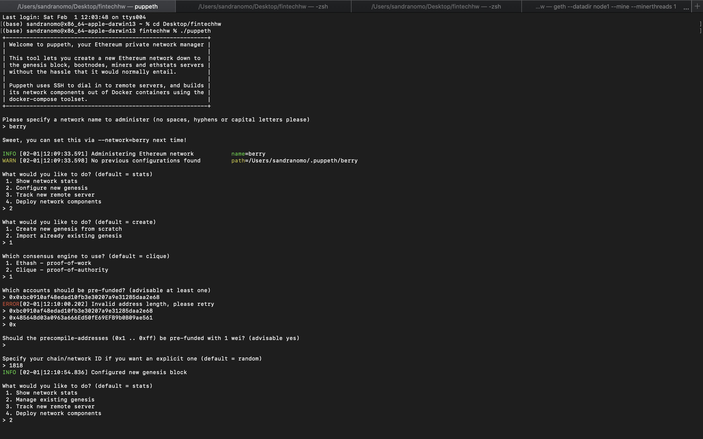
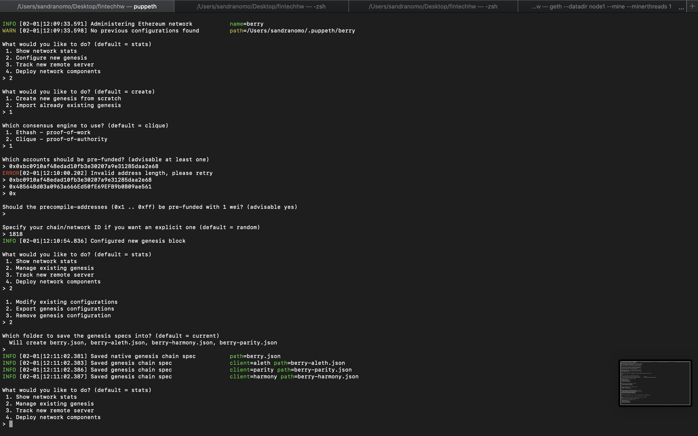
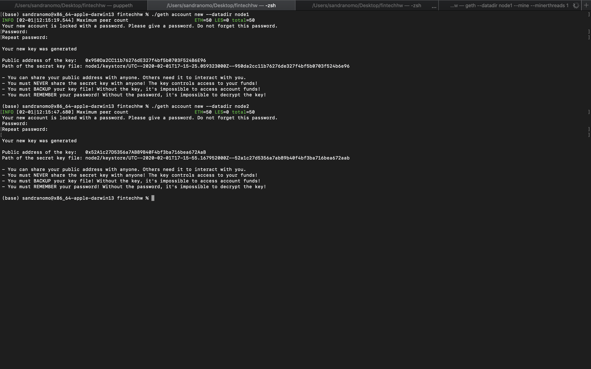
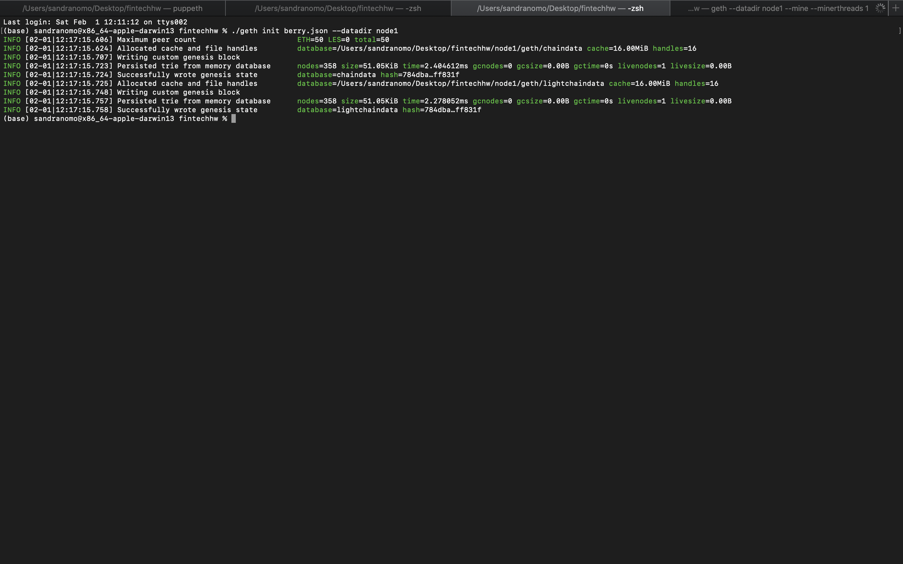
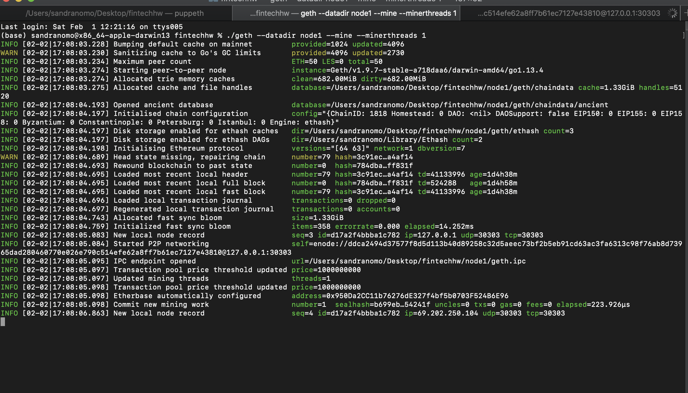
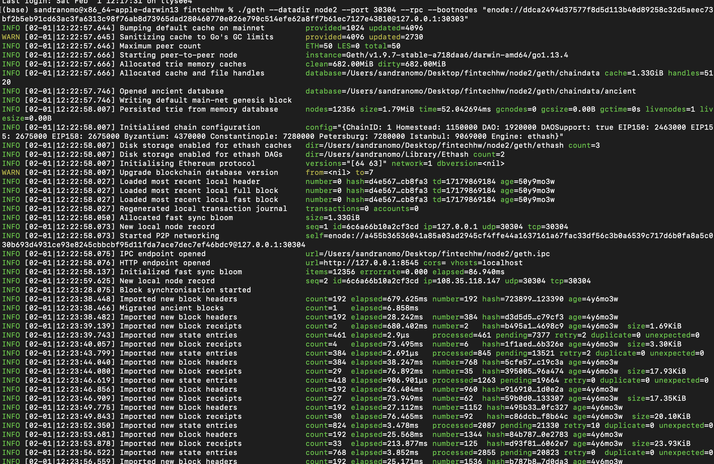
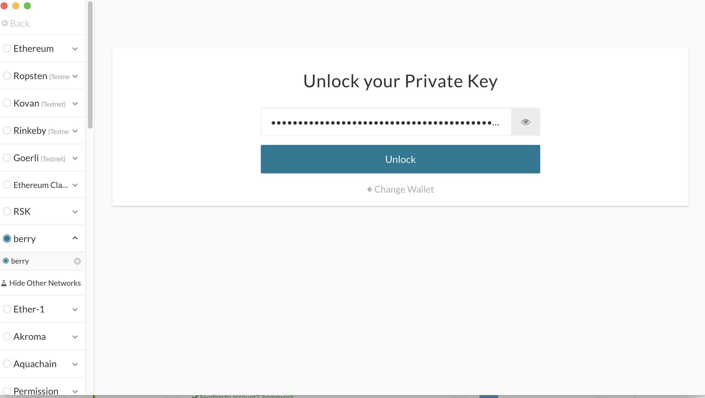
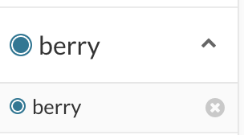
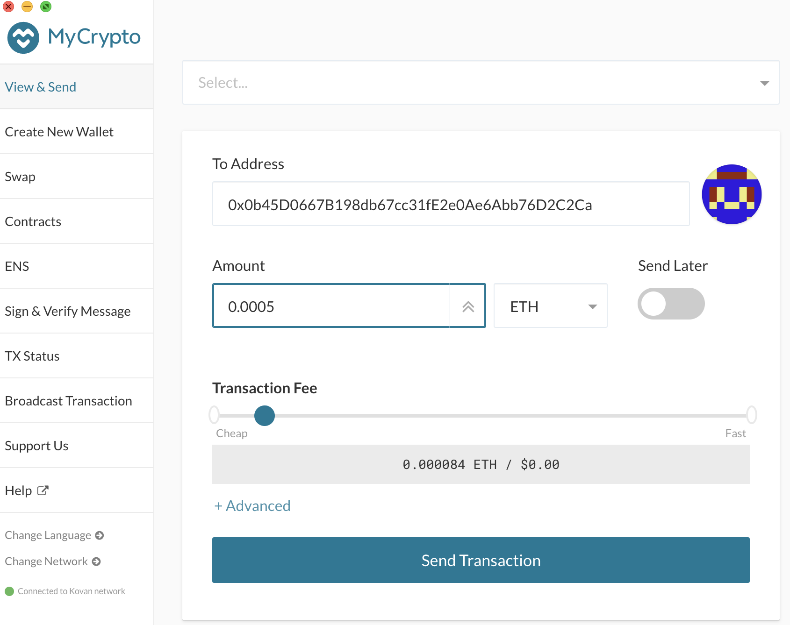
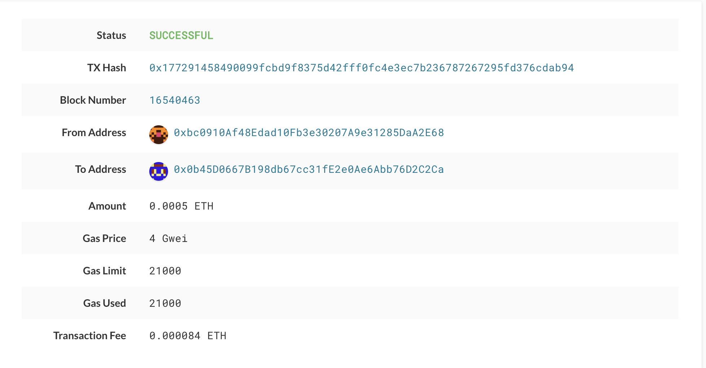

# Blockchain_homework

**Testnet Blockchain at ZBank**

This project consist on the creation of a blockchain network, with which at the end a transaction between two accounts managed with MyCryto application is made. The following are the steps taken to achieve this process.

Network Creation
The following image shows the creation of the network

The network created was named "Berry", then the genesis was configured from scratch, with proof of work, The two addresses used are:

account1_homework: 0xbc0910af48edad10fb3e30207a9e31285daa2e68

account2_homework: 0x48564Bd03a0963a666Ed50fE69EFB9b0B09ae561

The chain ID  1818

The following image shows the set up of the network

Steps: 

1) Specify a Network
2) Configure new genesis
3) Create new genesis
4) Select which consensus engine to use. I try Proof of autority at first but I was not able to sent ETH so I tried Proof of Work.
5) Select the account that should be pre-funded, the accounts. In this case, I've selected two accounts from MyCrypto.
6) Specify the network which you will be using when you create a new network in MyCrypto.
7) Manage existing genesis
8) Export genesis configuration.
9) Voila! Json file has been created! 

**Nodes initialization and activation into mining**

**Launching node 1 into mining mode
The enode code is used to launch the second node into mining mode**

**Launching node 2 into mining mode**

***enode://ddca2494d37577f8d5d113b40d89258c32d5aeec73bf2b5eb91cd63ac3fa6313c98f76ab8d73965dad280460770e026e790c514efe62a8ff7b61ec7127e43810@127.0.0.1:30303***

**Setting transfer between the two accounts:**

To send a transfer we launch MyCryto app and select the network created "berry" and use "Private Key" option to log into the address from which you want to send funds.

Once loged in indicate the address to wich you want to send funds, select the amount to be send and the fee to be charged.

Confirming transfer between the two accounts:

